# Toyni: A STARK Implementation in Progress
> [!WARNING]
> Toyni was migrated from [jonas089's Github](https://github.com/jonas089/Toyni)
> Click [here](https://github.com/jonas089/Toyni) to see the past commit history.

Welcome to Toyni! This is an implementation of a STARK (Scalable Transparent Argument of Knowledge) proving system in Rust. While it's not yet a full zero-knowledge STARK, it provides a solid foundation for understanding how STARKs work.


Meet the amazing artist behind this creation, [Kristiana Skrastina](https://www.linkedin.com/in/kristiana-skrastina/)


> [!WARNING]  
> This is a research project and hasn't been audited. Use at your own risk.

## 0. Background, STARK Verifier: Constraint vs FRI Layer Checks

## ✅ Constraint Check (Single Layer)
- For each randomly sampled point `x`:
  - Verifier checks:
    ```
    Q(x) * Z(x) == C(x)
    ```
  - Ensures that the execution trace satisfies all constraints
  - **This check is done once per point**
  - **Not done across layers**
  - Merkle proof is optional (depends on how C(x) and Q(x) are committed)

---

## ✅ FRI Layer Checks (Multiple Layers)
- Purpose: Prove that `Q(x)` is a **low-degree polynomial**
- Process:
  1. Start with evaluations of `Q(x)` over the domain (Layer 0)
  2. Recursively apply `fri_fold()` to reduce degree at each layer
  3. At each layer:
     - Verifier checks Merkle proofs for sampled values
     - Verifies that folding is consistent with previous layer
  4. Final layer should be constant or degree-1, checked directly

- ✅ Merkle proofs are **checked at each FRI layer**
- ✅ Folding correctness is verified at each layer

---

## 🔍 STARK Verifier Flow: Visual Diagram

```mermaid
sequenceDiagram
    participant Proof_Data
    participant Constraint_Check
    participant FRI_Protocol
    participant FRI_Merkle_Commitment
    participant FRI_Consistency
    participant FRI_Layers
    participant Accept_Proof

    Proof_Data-->Constraint_Check: Check Q(x)·Z(x) == C(x)
    Proof_Data-->FRI_Protocol: Begin FRI protocol
    FRI_Protocol-->FRI_Merkle_Commitment: Verify Merkle proofs
    FRI_Merkle_Commitment-->FRI_Consistency: Check folding inputs + β
    FRI_Consistency-->FRI_Layers: Fold with β0..βn
    FRI_Layers-->Accept_Proof: ✅ Accept Proof
```



>[!NOTE]
> FRI folding equation:
> f_{i+1}(x²) = (fᵢ(x) + fᵢ(–x) + βᵢ · (fᵢ(x) – fᵢ(–x))) / 2

## 🔐 STARK Verifier: Security Parameters for 128-bit Soundness

### FRI QUERIES
To achieve **128-bit soundness** in STARK proofs, the total probability that a cheating prover is accepted must be less than `2⁻¹²⁸`.

This involves carefully choosing parameters for:

- Constraint checks (`Q(x)` evaluations)
- FRI protocol (number of layers and queries per layer)

> Example:
> - If `L = 20` layers → `log₂(20) ≈ 4.3`
> - Then: `m ≈ 133` queries per layer
---

### CONSTRAINT CHECKS
> Example:
> - If `d / N = 1/4`, then `log₂(N/d) = 2`
> - So: `n = 128 / 2 = 64` spot checks

> - If `d / N = 1/8`, then `log₂(N/d) = 3`
> - So: `n = 128 / 3 ≈ 43`, but round up to be safe
---

### ✅ Practical Recommendation:
Use `n = 64–80` spot checks for strong 128-bit soundness across typical domain/degree ratios.

### ✅ Recommendations for 128-bit Security

| Component              | Suggested Value                    |
|-----------------------|------------------------------------|
| Constraint checks `n` | 64–80                              |
| FRI layers `L`        | log₂(N / degree of final poly)     |
| FRI queries `m`       | ≥ log₂(L) + 128 (e.g., 133)        |
| Total soundness error | ε_total = ε_constraints + ε_fri ≤ 2⁻¹²⁸ |

## 🔁 Summary

| Check Type         | Equation Checked              | Merkle Proofs | Multiple Layers? |
|--------------------|-------------------------------|----------------|-------------------|
| Constraint Check   | `Q(x) * Z(x) == C(x)`          | Optional       | ❌ No             |
| FRI Layer Check    | Folding consistency, low-degree| ✅ Yes          | ✅ Yes            |


## 1. Introduction

STARKs are a powerful cryptographic tool that enables proving the correct execution of a computation without revealing the underlying data. Think of it as a way to convince someone that you know the solution to a puzzle without actually showing them the solution. This property, known as zero-knowledge, is crucial for privacy-preserving applications in areas like financial transactions, voting systems, and private identity verification.

### 2. Why STARKs Matter

| Scalability | Transparency | Zero-Knowledge |
|-------------|--------------|----------------|
| • O(log² n) proof size | • No trusted setup | • Privacy |
| • Fast verify | • Public parameters | • Confidentiality |
| • Efficient | | • Data protection |
| | | • Secure sharing |

### 3. Real-World Applications

| Financial | Identity | Computing |
|-----------|----------|-----------|
| • Private payments | • Age verification | • Confidential computing |
| • Asset ownership | • Credential validation | • Private ML |
| | | • Secure MPC |

## 4. Technical Overview

At its heart, Toyni consists of three main components working together:

| Virtual Machine | Constraint System | STARK Prover |
|----------------|-------------------|--------------|
| • Executes programs | • Defines rules | • Generates proofs |
| • Creates traces | • Validates states | • Uses FRI protocol |

### 5. How It Works

| Program Execution | Execution Trace | Verification |
|------------------|-----------------|--------------|
| • Run program | • Record states | • Sample positions |
| • Track state | • Build constraints | • Check constraints |
| • Generate trace | | |

Here's a simple example that demonstrates how Toyni works. We'll create a program that proves a sequence of numbers increments by 1 each time:

```rust
fn test_valid_proof() {
    let mut trace = ExecutionTrace::new(4, 1);
    for i in 0..4 {
        let mut row = HashMap::new();
        row.insert("x".to_string(), i);
        trace.insert_column(row);
    }

    let mut constraints = ConstraintSystem::new();
    constraints.add_transition_constraint(
        "increment".to_string(),
        vec!["x".to_string()],
        Box::new(|current, next| {
            let x_n = Fr::from(*current.get("x").unwrap() as u64);
            let x_next = Fr::from(*next.get("x").unwrap() as u64);
            x_next - x_n - Fr::ONE
        }),
    );
    constraints.add_boundary_constraint(
        "starts_at_0".to_string(),
        0,
        vec!["x".to_string()],
        Box::new(|row| Fr::from(*row.get("x").unwrap() as u64)),
    );

    let prover = StarkProver::new(&trace, &constraints);
    let proof = prover.generate_proof();
    let verifier = StarkVerifier::new(&constraints, trace.height as usize);
    assert!(verifier.verify(&proof));
}
```

This example demonstrates how Toyni can prove that a sequence of numbers follows a specific pattern (incrementing by 1) without revealing the actual numbers. The proof can be verified by anyone, but the actual values remain private.

### 6. Security Properties

STARKs achieve their security through a combination of domain extension and low-degree testing. Here's how it works:

| Domain Extension | Low-Degree Testing | Soundness Guarantees |
|-----------------|-------------------|---------------------|
| • Extend domain | • FRI protocol | • Soundness error: (1/b)^q |
| • Blowup factor | • Polynomial degree | • Query complexity |

The security of a STARK proof relies on two key mechanisms:

1. **Domain Extension (Blowup)**: The composition polynomial is evaluated over a domain that's `b` times larger than the original trace length, where `b` is the blowup factor.

2. **Low-Degree Testing**: The FRI protocol ensures that the polynomial being tested is close to a valid low-degree polynomial.

The soundness error (probability of accepting an invalid proof) is bounded by:

```
Pr[undetected cheat] = (1/b)^q
```

where:
- `b` is the blowup factor (e.g., 8 in our example)
- `q` is the number of queries made by the verifier

This means that if a prover tries to cheat by modifying a fraction 1/b of the domain, the verifier will detect this with probability at least 1 - (1/b)^q. For example, with a blowup factor of 8 and 10 queries, the soundness error is at most (1/8)^10 ≈ 0.0000001.

## 7. Project Structure

The codebase is organized into logical components:

| Math | VM | Library |
|------|----|---------|
| • Polynomial | • Constraints | • Entry point |
| • Domain | • Trace | • Public API |
| • FRI | • Execution | • Documentation |
| • STARK | | |


### 8. Current Features

| Constraint System | FRI Protocol | Mathematical Operations |
|------------------|--------------|------------------------|
| • Transition constraints | • Low-degree testing | • Polynomial arithmetic |
| • Boundary constraints | • Interactive verification | • Field operations |
| • Quotient verification | • FRI folding layers | • Domain operations |
| • Merkle commitments | • Folding consistency checks | • Secure commitments |

### 9. Missing Components

| Zero-Knowledge | Fiat-Shamir Transform | Performance |
|----------------|----------------------|-------------|
| • Trace privacy | • Deterministic hashing | • Parallel processing |
| • State protection | • Non-interactive proofs | • Batch verification |
| • Circuit-specific | • Secure randomness | • Optimized FRI |

While we have a working STARK implementation with quotient polynomial verification and FRI folding, there are still some components to implement:

1. **Fiat-Shamir Transform**: Currently using random number generation instead of deterministic hashing, making the protocol interactive.
2. **Performance Optimizations**: Need to implement parallel processing and batch verification for better scalability.
3. **Circuit-Specific Features**: Add support for specialized circuits and optimizations.

### 10. Roadmap

#### Completed Features ✅
- Basic STARK implementation with constraint checks
- FRI protocol with folding layers
- Merkle commitments for FRI layers
- Folding consistency verification
- Interactive verification protocol

#### In Progress 🚧
- Fiat-Shamir transform implementation
- Performance optimizations
- Circuit-specific optimizations

#### Future Work 📅
- Zero-knowledge enhancements
- Parallel processing support
- Batch verification
- Circuit-specific optimizations
- Documentation improvements

### 11. Security Properties

STARKs achieve their security through a combination of domain extension, low-degree testing, and Merkle commitments. Here's how it works:

| Domain Extension | Low-Degree Testing | Merkle Commitments |
|-----------------|-------------------|-------------------|
| • Extend domain | • FRI protocol | • Tree structure |
| • Blowup factor | • Polynomial degree | • Proof generation |
| • Soundness | • Folding checks | • Commitment verification |

The security of a STARK proof relies on three key mechanisms:

1. **Domain Extension (Blowup)**: The composition polynomial is evaluated over a domain that's `b` times larger than the original trace length.

2. **Low-Degree Testing**: The FRI protocol ensures that the polynomial being tested is close to a valid low-degree polynomial, with folding consistency checks at each layer.

3. **Merkle Commitments**: Each FRI layer is committed using a Merkle tree, ensuring the integrity of the folding process and enabling efficient verification.

The soundness error (probability of accepting an invalid proof) is bounded by:

```
Pr[undetected cheat] = (1/b)^q
```

where:
- `b` is the blowup factor (e.g., 8 in our example)
- `q` is the number of queries made by the verifier

This means that if a prover tries to cheat by modifying a fraction 1/b of the domain, the verifier will detect this with probability at least 1 - (1/b)^q. For example, with a blowup factor of 8 and 10 queries, the soundness error is at most (1/8)^10 ≈ 0.0000001.

## 12. Contributing

We welcome contributions to Toyni! Our current focus is on implementing zero-knowledge properties and improving the overall system. We're particularly interested in:

1. Implementing Merkle tree commitments and the Fiat-Shamir transform
2. Adding comprehensive test coverage and security audits
3. Improving documentation and adding more examples
4. Optimizing performance and reducing proof sizes

# 13. Associated With

<div align="center">

| <a href="https://ciphercurve.com"></a> |
|:---:|
| [Ciphercurve](https://ciphercurve.com) |

</div>

---

<div align="center">
  <h3>2025 Ciphercurve</h3>
  <p><em>Building the future of privacy-preserving computation</em></p>
</div>


